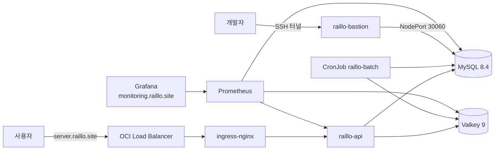

# 인프라

빌드, 배포, 운영 클러스터, 로컬 실행 환경을 다룬다. 매니페스트는 `k8s/oke/`, 워크플로는 `.github/workflows/`에 있다.

## 구성



- 운영은 Oracle Cloud의 OKE(Kubernetes)에 있다. 노드는 `raillo-node: app`(API, Ingress)과 `raillo-node: data`(MySQL, Valkey) 두 종류다.
- MySQL과 Valkey는 클러스터 안의 StatefulSet이다. 관리형 DB가 아니다.
- `k8s/eks/`는 이전 AWS EKS 매니페스트다. 지금 배포에 쓰지 않는다.

## 환경

| 환경 | 프로파일 | DB, Redis | 용도 |
|---|---|---|---|
| 로컬 실행 | `dev` (기본값) | `.env`의 `DB_URL`, Valkey는 `compose.yaml`이 자동 기동 | 개발 |
| 테스트 | `test` | Testcontainers (MySQL 8.4.10, Valkey 9) | `./gradlew test` |
| 부하 테스트 | `dev` | `compose-test.yaml` (MySQL, Valkey, WireMock, Prometheus, Grafana) | k6, `qa/scripts/bootstrap-test-env.sh` |
| 운영 | `prod` (이미지에 고정) | OKE의 MySQL, Valkey | 서비스 |

- `dev`는 `ddl-auto: update`라 테이블을 만든다. `prod`는 `validate`라 테이블이 없으면 뜨지 않는다.
- 모든 시각은 한국 시간이다. 이미지가 `TZ=Asia/Seoul`과 `-Duser.timezone=Asia/Seoul`로 고정한다.

## 배포

1. `develop`에 push하면 `Build and Test with Gradle`이 `./gradlew build`를 돌린다. PR도 같은 검사를 받는다.
2. 그 워크플로가 push에서 성공하면 `Build ARM64 images and deploy to OKE`가 시작한다. **승인 단계 없이 운영에 배포된다.**
3. `raillo-api`, `raillo-batch` 이미지를 ARM64로 빌드해 GHCR에 `latest`와 `sha-{커밋}` 태그로 올린다.
4. `k8s/oke/api-server/`, `k8s/oke/batch/` 매니페스트의 이미지를 `sha-{커밋}`으로 바꿔 `kubectl apply` 한다.
5. `raillo-api` rollout이 끝나기를 기다린다. CronJob은 다음 실행부터 새 이미지를 쓴다.

- 규칙
  - 배포는 한 번에 하나만 돈다(`concurrency: raillo-oke-production`).
  - **ConfigMap(`raillo-config`), Secret(`raillo-secrets`, `ghcr-secret`), MySQL, Valkey, 모니터링은 배포가 건드리지 않는다.** 바꾸려면 직접 `kubectl apply` 한다. 배포는 두 Secret과 ConfigMap이 `api-server`, `batch` 네임스페이스에 있는지만 확인한다.
  - DB 스키마를 바꾸는 변경은 `prod`가 `validate`이므로 배포 전에 DB에 직접 반영해야 한다.
  - 수동 배포는 `workflow_dispatch`로 `develop`에서만 할 수 있다.

## 클러스터 리소스

| 네임스페이스 | 리소스 | 설정 |
|---|---|---|
| `api-server` | `raillo-api` Deployment, Service, Ingress | 1대, CPU 1, 메모리 2Gi, 힙은 메모리의 75%. probe는 `/health` |
| `batch` | `train-daily-schedule`, `delete-expired-members` CronJob | 03:00, 04:00 (한국 시간), 동시 실행 금지. Job은 [batch](../batch/README.md) |
| `mysql` | `mysql` StatefulSet, PVC 50Gi | `mysql-admin` NodePort 30060으로 클러스터 밖 접속 |
| `valkey` | `valkey` StatefulSet | AOF(`everysec`), RDB 없음, `maxmemory 2gb`, `noeviction` |
| `monitoring` | Prometheus, Grafana, kube-state-metrics, node-exporter, mysql-exporter, valkey-exporter | Grafana는 `monitoring.raillo.site` |
| (클러스터) | ingress-nginx, cert-manager `raillo-issuer` | OCI Load Balancer, Let's Encrypt |

- 규칙
  - Valkey가 `noeviction`이므로 메모리가 차면 쓰기가 실패한다. 예약과 열차 캐시 키를 지워서 공간을 만들지 않는다.
  - `/actuator/**`는 인증 없이 열려 있고 같은 Ingress로 나간다.

## 접속

운영 MySQL은 bastion을 거쳐 SSH 터널로 붙는다.

```bash
ssh -f -N -L 13306:10.0.10.198:30060 raillo-bastion
```

`jdbc:mysql://127.0.0.1:13306/{DB}`로 접속한다. 한 MySQL에 DB가 여러 개 있으므로 접속 전에 DB 이름을 확인한다. 테이블 초기화는 `/db-reset`을 쓴다.

## 모니터링

- Prometheus가 `raillo-api`의 `/actuator/prometheus`, MySQL, Valkey, 노드, 컨테이너 지표를 수집한다.
- Grafana 대시보드는 `k8s/oke/monitoring/grafana-dashboards-configmap.yaml`에 있다.

## 설계 결정

### 배포는 커밋 SHA 태그로 고정한다
- 맥락: 매니페스트는 `latest`를 가리킨다. `latest`로 apply 하면 매니페스트가 바뀌지 않아 rollout이 일어나지 않고, 어떤 커밋이 떠 있는지 알 수 없다.
- 결정: 배포 때 매니페스트의 이미지를 `sha-{커밋}`으로 바꿔 apply 한다.
- 결과: 배포마다 rollout이 일어나고, 떠 있는 이미지로 커밋을 알 수 있다. 저장소의 매니페스트는 계속 `latest`를 가리키므로 손으로 apply 하면 `latest`가 뜬다.

### API와 Batch는 한 Dockerfile로 빌드한다
- 맥락: 두 앱은 같은 JDK, 같은 시간대, 같은 실행 사용자를 써야 한다.
- 결정: `APP_MODULE` 빌드 인자로 모듈만 고른다. CronJob의 `args`가 `java -jar` 뒤에 붙는다.
- 결과: 실행 환경이 둘로 갈라지지 않는다. Batch에도 `SPRING_PROFILES_ACTIVE=prod`가 들어가지만 Batch에는 프로파일별 설정 파일이 없어 영향이 없다.
