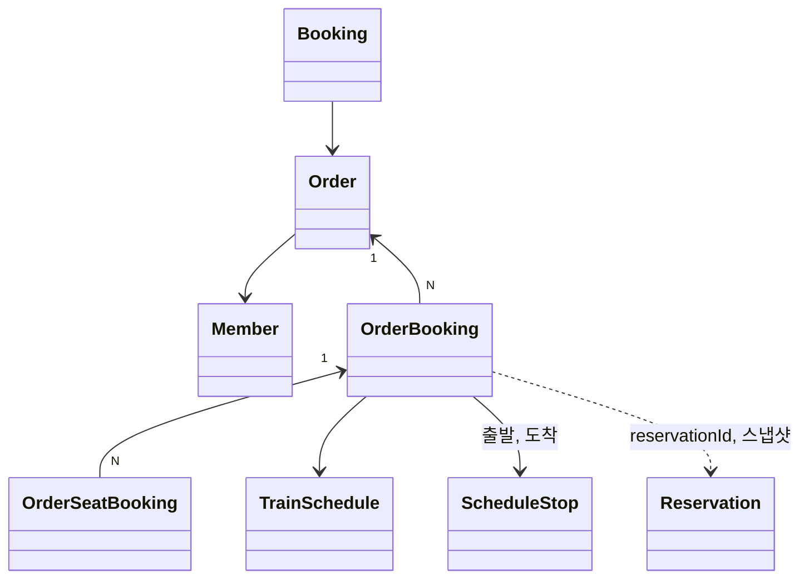

# 주문

## 도메인

- **주문**은 예약 여러 개를 한 번에 결제하려고 묶은 것이다. 왕복처럼 서로 다른 운행의 예약을 함께 결제할 수 있다.
- 주문은 따로 만드는 API가 없고, 승객이 **결제를 준비할 때** 만들어진다.
  1. 승객이 결제할 예약들을 고른다. 모두 자기 예약이고 아직 만료되지 않아야 한다
  2. 예약 구간이 이미 팔린 좌석과 겹치지 않는지 DB에서 확인한다
  3. 주문을 결제 대기 상태로 만들고, 결제를 만든다
- 주문 금액은 예약들의 총 운임을 더한 값이다.
- 결제가 승인되면 주문이 완료되고, 주문의 예약마다 예매가 만들어진다.
- 결제 시간이 지나면 주문은 만료된다.
- 주문 코드는 결제사(Toss)에 넘기는 주문 번호로도 쓴다.

## 용어

| 한국어 | 영어 | 설명 |
|---|---|---|
| 주문 | Order | 한 번에 결제하는 예약 묶음 |
| 주문 예매 | OrderBooking | 주문에 담긴 예약 하나. 예약의 운행, 구간, 총 운임을 가진다 |
| 주문 좌석 | OrderSeatBooking | 주문 예매의 좌석 하나. 승객 유형과 운임을 가진다 |
| 예약 스냅샷 | reservationSnapshot | 주문을 만들 때 복사해 둔 예약 JSON |
| 주문 코드 | orderCode | 고객과 결제사에 보이는 주문 번호 |

## 도메인 모델

### [주문]

#### 주문(Order)
Aggregate Root, 테이블 `orders`

- 속성: `member`, `orderCode`, `orderStatus`, `totalAmount`, `expiredAt`
- 행위
  - `static create(member, totalAmount)`: 결제 대기 상태로 만든다
  - `completePayment()`: 주문 완료
  - `expired()`: 주문 만료. 만료 일시를 저장한다
  - `validateCompleted()`: 주문이 완료됐는지 확인한다. 예매를 만들기 전에 부른다
- 규칙
  - 주문 코드는 `ORD_` + `yyMMddHHmmss` + 숫자 4자리다
  - 주문 금액은 0 이상이다
  - 결제 대기 상태에서만 완료되거나 만료될 수 있다
  - 완료된 주문에서만 예매를 만들 수 있다
  - `expired()`를 부르는 곳은 아직 없다. 결제하지 않은 주문은 결제 대기로 남는다

#### 주문 예매(OrderBooking)
Entity, Order N:1

- 속성: `reservationId`, `trainSchedule`, `departureStop`, `arrivalStop`, `totalFare`, `reservationSnapshot`
- 행위: `static create(...)`, `captureReservation(snapshot)`
- 규칙
  - 같은 예약이 여러 주문에 담길 수 있다. 예약 ID에 유니크 제약이 없다

#### 주문 좌석(OrderSeatBooking)
Entity, OrderBooking N:1

- 속성: `seatId`, `passengerType`, `fare`
- 규칙: `seatId`는 좌석 엔티티 연관이 아니라 ID 값이다

#### 주문 상태(OrderStatus)
Enum

- `PENDING` 결제 대기, `ORDERED` 주문 완료(결제 완료), `EXPIRED` 만료

### 서비스

#### 주문 서비스(OrderService)
`raillo-api`의 `order/application/`에 있다. 결제 도메인이 `OrderRegister`, `OrderReader` 포트로만 호출한다.

- `createOrder(memberNo, reservations)`: 주문, 주문 예매, 주문 좌석을 만들고 예약 스냅샷을 저장한다
- `getOrderByOrderCode(orderCode)`, `validateOrderOwner(order, member)`
- `getReservationIds(order)`: 주문에 담긴 예약 ID. 결제 승인 전에 예약이 아직 살아 있는지 확인하는 데 쓴다
- `getReservationSnapshots(order)`: 저장해 둔 예약 스냅샷. 결제 확정에 쓴다
- 규칙: 예약 없이 주문을 만들 수 없다

## 설계 결정

### 주문을 만들 때 예약을 스냅샷으로 복사한다
- 맥락: 예약은 Redis에서 TTL로 사라진다. 결제 승인이 늦게 끝나거나 재시도되면, 예매를 만드는 시점에 원본 예약이 이미 없을 수 있다.
- 결정: 주문 예매에 예약 JSON 전체를 `reservationSnapshot`으로 저장하고, 결제 확정과 예매 전환은 이 스냅샷을 읽는다.
- 결과: Redis 예약이 만료돼도 결제를 확정할 수 있다. 스냅샷은 주문 시점의 운임과 구간이므로 이후 운임이 바뀌어도 결제 금액이 흔들리지 않는다.
