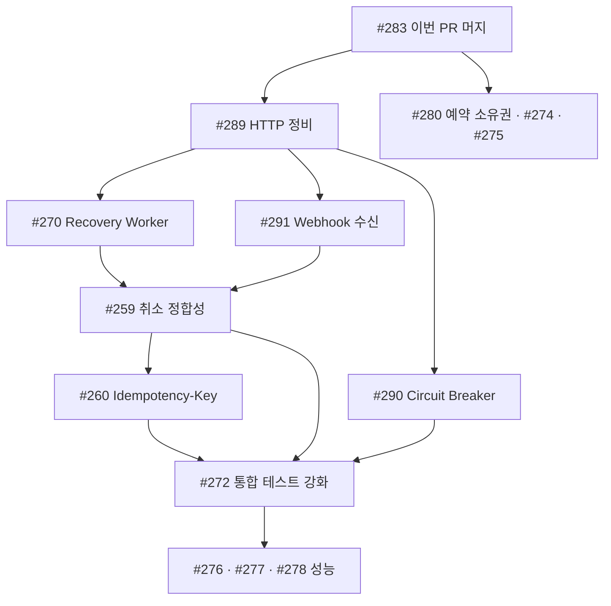

# 결제 정합성 확보 · 후속 작업 로드맵

초안: 2026-09-20. 갱신: 2026-09-22.

이 문서는 결제·좌석 이관과 정합성 확보 작업의 전체 로드맵입니다. `feature/266-payment-outbox-worker`에서 마무리한 작업과 후속 이슈들의 순서·의존성을 함께 정리합니다.

## 1. 지금 상태 (2026-09-22)

- `develop`에는 `#273`(Reservation 생성 재설계)까지 반영됐습니다.
- `#266`은 열린 PR(#283)로 리뷰 대기 중입니다.
- 이번 브랜치에서 아래 세 축이 완결됐습니다.
  - Outbox Worker 도입과 승인 확정 후 Redis 정리 이관.
  - 결제 승인 3단계 트랜잭션 구조 재정비 (pre-check → TX A → TX B).
  - 사용자 재시도 시 IN_PROGRESS attempt 정정 경로 도입 (Toss `GET /v1/payments/{paymentKey}`).

## 2. 확정한 핵심 원칙

- **결제 실패 정책** — Toss 4xx 확정 실패에서 attempt만 FAILED로 마킹하고 Payment는 PENDING을 유지합니다. 같은 Order에 대한 새 결제 시도를 열어두기 위해서입니다.
- **`Payment.payment_key` 저장 시점** — 승인 확정 시에만 세팅합니다. Payment에 paymentKey가 있다는 사실이 곧 "이 결제는 승인 확정됐다"는 불변식이 성립하도록 합니다.
- **`attempt_id` 서버 파생** — 클라이언트가 attemptId를 보내지 않고 서버가 `SHA-256("apv:" + paymentKey)`로 파생합니다. `payment_attempt.attempt_id`의 DB unique 제약이 서버 dedup을 담당합니다.
- **3층 재검증 구조** — pre-check(`PaymentApprovalStarter`) → TX A(`PaymentAttemptManager`) → TX B(`PaymentApprovalFinalizer`)에서 같은 검증을 반복 수행합니다. 첫 층은 빠른 fail, 나머지 두 층은 동시성 방어입니다.
- **재시도 정책** — POST(confirm·cancel) 자동 재시도는 금지하고 IN_PROGRESS attempt와 회복 경로에 위임합니다. GET(query)은 idempotent이므로 5xx·connection reset에 한해 짧은 자동 재시도를 허용합니다.

## 3. 결제 정합성 4단 방어층

Webhook까지 도입되면 응답 유실·장애 시나리오의 방어층이 완결됩니다.

| 층 | 트리거 | 담당 | 상태 |
|---|---|---|---|
| 1차 | 사용자의 실시간 confirm 응답 | `PaymentConfirmService` | 완료 |
| 2차 | 사용자가 결제창에서 재시도 시 query 조회 | `PaymentApprovalStarter.recoverInProgressAttempt` | 완료 (#266 브랜치) |
| 3차 | Toss Webhook 수신 | Webhook endpoint (#291) | 후속 |
| 4차 | Recovery Worker 폴링 | `PaymentRecoveryWorker` (#270) | 후속 |

각 층이 놓친 케이스를 다음 층이 잡습니다. Webhook은 Recovery Worker의 push 채널로 회복 속도를 초 단위로 낮춥니다.

## 4. 후속 이슈 그룹

작업 축은 네 개입니다.

**A. Reservation lifecycle과 정합성**
- [#270](https://github.com/penggu-dev/raillo-backend/issues/270) Recovery Worker 도입과 예약 lifecycle 관리. Recovery Worker 대사와 예약 lifecycle 관리(결제 시작 시 TTL 연장, 실패 시 복원, 최대 대기 초과 시 삭제)를 함께 다룹니다. P1-2 흡수.
- [#280](https://github.com/penggu-dev/raillo-backend/issues/280) 예약 단위 결제 소유권 강제 (P1-1).
- [#259](https://github.com/penggu-dev/raillo-backend/issues/259) 결제 취소 정합성.
- [#272](https://github.com/penggu-dev/raillo-backend/issues/272) 통합 테스트 강화.

**B. HTTP 클라이언트와 회복 채널**
- [#289](https://github.com/penggu-dev/raillo-backend/issues/289) Toss HTTP 클라이언트 정비 (Apache HttpClient 5 · timeout · 커넥션 풀 · 관측성).
- [#290](https://github.com/penggu-dev/raillo-backend/issues/290) Toss 호출에 Circuit Breaker (Resilience4j) 도입.
- [#291](https://github.com/penggu-dev/raillo-backend/issues/291) Toss Webhook 수신과 IN_PROGRESS attempt 정정.

**C. Idempotency 계약**
- [#260](https://github.com/penggu-dev/raillo-backend/issues/260) 클라이언트 Idempotency-Key 헤더와 attempt_id → Toss 헤더 승격.

**D. 성능과 인프라**
- [#274](https://github.com/penggu-dev/raillo-backend/issues/274) 예약 소유권과 조회 계약.
- [#275](https://github.com/penggu-dev/raillo-backend/issues/275) 잔여석 중복 차감.
- [#276](https://github.com/penggu-dev/raillo-backend/issues/276) 부하 측정.
- [#277](https://github.com/penggu-dev/raillo-backend/issues/277) Outbox Worker JVM 분리.
- [#278](https://github.com/penggu-dev/raillo-backend/issues/278) 잔여석 성능 개선.

## 5. 착수 순서

우선순위와 의존성을 고려한 순서입니다.

1. **#283 리뷰·머지** — 이번 PR. 3단계 정합성 기반이 develop에 반영돼야 후속 작업의 기준선이 확정됩니다.
2. **#289 HTTP 클라이언트 정비** — timeout이 유한하지 않으면 5xx/응답 유실 경로의 정합성 방어가 실제로 발동하지 않습니다. 가장 시급합니다.
3. **병렬 진행 가능** — 서로 상태 판단 로직을 공유합니다.
   - #270 Recovery Worker + 예약 lifecycle 관리. 착수 시점에 방향 A(TTL을 attempt lifecycle에 종속) vs 방향 B(스냅샷 저장)를 확정하고 상태 전이별 예약 정리 정책, 최대 대기 시간, Redis 원자적 TTL 조작 Lua 스크립트까지 이 이슈에서 함께 다룹니다. 상세는 §8 참조.
   - #291 Webhook 수신 + `recoverInProgressAttempt` 로직 공용화.
4. **#259 결제 취소 정합성** — #270·#291의 상태 판단 공용 컴포넌트를 사용해 취소 흐름 발행·소비까지 완성합니다. 착수 시 취소 attempt_id 파생 규칙을 확정합니다(코멘트 참조).
5. **#260 Idempotency-Key 계약** — #259 이후. 클라이언트 헤더 계약과 서버 attempt_id, Toss 헤더 승격까지 chain을 완성합니다.
6. **#290 Circuit Breaker** — #289 이후. HTTP 클라이언트가 정비된 뒤 breaker 임계값·open duration을 실측 기반으로 정합니다.
7. **#272 통합 테스트 강화** — 위 이슈들이 대체로 완료된 뒤 회귀 방지.
8. **#280 예약 소유권**, **#274**, **#275** — 각각 병렬로 진행 가능합니다.
9. **#276·#277·#278** — 정합성 작업이 안정된 뒤 성능 개선.



## 6. Idempotency chain (완성 후 모습)

`#260` 완료 시점에 3층 idempotency 방어가 성립합니다.

```
클라이언트 → [Idempotency-Key 헤더] → 우리 서버 → [Idempotency-Key 헤더] → Toss
              (사용자 재클릭 방어)     (attempt_id로 저장)   (Toss 서버 dedup)
```

- 클라이언트 층: `#260`에서 계약 도입.
- 서버 층: `#266`에서 `attempt_id` 서버 파생과 DB unique 제약 도입 완료.
- Toss 층: Toss는 모든 POST API가 `Idempotency-Key` 헤더를 지원하고 15일 TTL로 dedup합니다(공식 문서 확인 완료). `#260` 착수 시점에 attempt_id를 이 헤더로 승격합니다.

## 7. 취소 attempt_id 파생 규칙 재검토

현재 `PaymentAttemptIds.forCancellation(paymentKey, sequence)`는 placeholder입니다. sequence 기반은 티켓 단위 dedup을 보장하지 못합니다. `#259` 착수 시점에 다음 후보 중에서 정책을 확정합니다.

- **A. 티켓 ID 기반** — `sha256("cnl:" + paymentKey + ":" + ticketId)`. 티켓 단위 재취소가 자연스럽게 dedup.
- **B. 대상 조합 hash** — 정렬된 ticketId 리스트를 join해 hash. 부분 취소 배치 dedup.
- **C. 클라이언트 지정 Idempotency-Key** — `#260` 계약과 연동해 클라이언트 헤더 값을 attempt_id로 저장.

관련 코멘트: https://github.com/penggu-dev/raillo-backend/issues/259#issuecomment-5762779635

## 8. Reservation lifecycle 관리 방향

`#270` 착수 시점에 아래 항목을 확정합니다. 이 결정은 예약 만료 후 회복 불가(P1-2) 시나리오를 어떻게 다룰지 정의하며, 결제 정합성 방어층의 마지막 조각입니다.

### 방향 후보

- **A. 예약 TTL을 attempt lifecycle에 종속** — `PaymentAttemptManager.startApprovalInNewTransaction` 시점에 대상 예약의 R field HPERSIST와 예약 본문 PERSIST를 걸어 attempt 처리 완료 시점까지 만료 방지. 스키마 변경이 없고 좌석 충돌 시나리오도 자연스럽게 회피되지만, 예약 정리 책임이 attempt 상태 전이에 붙어 코드 경로가 늘어납니다.
- **B. `payment_attempt`에 원래 요청 스냅샷 저장** — Recovery Worker가 스냅샷으로 finalize를 재실행. Redis 예약 만료와 무관하게 회복 가능하지만 좌석이 다른 예약에 재배정된 경우의 보상 정책이 별도로 필요합니다. `#270` 이슈 본문의 체크리스트가 이 방향에 기울어 있습니다.

### attempt 상태 전이별 예약 정리 정책

- `SUCCEEDED` — TX B의 R→B 전환에서 예약 삭제, 예매 좌석 저장.
- `FAILED` (Toss 4xx 또는 게이트웨이 조회에서 `ABORTED`/`EXPIRED` 확인) — 예약 본문의 `expiresAt`으로 남은 TTL 재계산해 복원. 사용자가 남은 시간 안에 새 결제 시도를 열 수 있게 합니다.
- 최대 대기 시간 초과 — Recovery Worker가 강제 FAILED로 마킹하고 예약 삭제.

### 함께 확정할 정책

- Recovery Worker 최대 대기 시간(예: attempt 생성 후 24시간).
- Redis 원자적 TTL 조작을 위한 Lua 스크립트 설계(여러 field HEXPIRE + 본문 EXPIRE 조합).

관련 코멘트: https://github.com/penggu-dev/raillo-backend/issues/270#issuecomment-5753956325

## 9. 참고 문서

- [`docs/payment-consistency.md`](./payment-consistency.md) — 결제 정합성 설계 상세.
- [`docs/payment-flow.html`](./payment-flow.html) — 결제 승인 흐름 다이어그램과 시나리오.
- [`docs/payment-cases.md`](./payment-cases.md) — 결제 케이스별 처리 정책.
- [`docs/payment-data-contracts.md`](./payment-data-contracts.md) — Redis·MySQL 데이터 계약.
- [`docs/payment-reservation-revised-plan.md`](./payment-reservation-revised-plan.md) — 재검토 시점의 계획서(이력).

## 10. 확정하지 않은 사항

- Webhook 수신 endpoint의 인증·인가 규칙(Toss가 public endpoint로 호출)은 `#291` 착수 시 결정합니다.
- Circuit Breaker 임계값(failure rate, sliding window, wait duration)은 `#289` 완료 후 응답 시간 실측을 기반으로 `#290`에서 결정합니다.
- Reservation lifecycle 방향(A vs B)과 최대 대기 시간은 `#270` 착수 시 확정합니다. 상세는 §8 참조.
- 취소 attempt_id 파생 규칙은 `#259` 착수 시 티켓 단위 정책과 함께 확정합니다.
