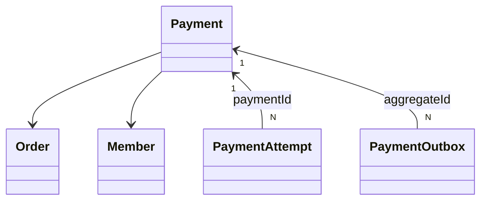

# 결제

## 도메인

- 승객은 예약을 고른 뒤 **결제 준비 → 결제창 → 결제 승인** 순으로 결제한다. 결제사는 토스페이먼츠(Toss)다.
- **결제 준비**
  - 고른 예약이 모두 자기 것이고 살아 있는지, 이미 팔린 좌석과 겹치지 않는지 확인한다.
  - [주문](../order/README.md)과 결제를 결제 대기 상태로 만들고 주문 코드와 금액을 돌려준다.
- **결제창**: 클라이언트가 주문 코드와 금액으로 Toss 결제창을 연다. 승객이 결제하면 Toss가 `paymentKey`를 준다.
- **결제 승인**
  - 클라이언트가 `paymentKey`, 주문 코드, 금액을 보내면 서버가 Toss에 승인을 요청한다.
  - 승인되면 주문이 완료되고 예매와 승차권이 만들어진다.
  - 좌석 점유를 예약에서 예매로 바꾸는 일은 잠시 뒤 [Worker](../worker/README.md)가 한다.
- 승인 요청은 같은 결제에 여러 번 올 수 있다(새로고침, 재시도). **카드는 한 번만 청구돼야 하고 예매도 한 번만 만들어져야 한다.**
- Toss가 승인했는지 모르는 경우가 있다(타임아웃, Toss 5xx). 이때는 실패로 단정하지 않고, 승객이 다시 요청하면 Toss에 상태를 조회해 맞춘다.

## 용어

| 한국어 | 영어 | 설명 |
|---|---|---|
| 결제 | Payment | 주문 하나에 대한 결제. 금액과 상태를 가진다 |
| 결제 시도 | PaymentAttempt | Toss에 보내는 승인 요청 하나의 기록. 같은 요청의 재시도는 같은 시도다 |
| 시도 ID | attemptId | 시도를 구분하는 외부 멱등 키. `paymentKey`에서 계산한다 |
| paymentKey | - | Toss가 결제창에서 발급한 결제 식별자 |
| 주문 코드 | orderCode | Toss에 넘기는 주문 번호(`orderId`). 주문의 주문 코드와 같다 |
| 결과 불명 | - | 요청은 나갔지만 Toss가 승인했는지 모르는 실패 |
| 미전송 | NOT_SENT | 요청이 Toss에 도달하지 않은 것이 확정인 실패 |
| TX A, TX B | - | 승인 시작 트랜잭션과 승인 확정 트랜잭션 |

## 도메인 모델

### [결제]

#### 결제(Payment)
Aggregate Root

- 속성: `member`, `order`, `orderCode`, `amount`, `paymentStatus`, `paymentKey`, `paymentMethod`, `paidAt`, `failedAt`, `cancelledAt`, `refundedAt`, `failureCode`, `failureMessage`
- 행위
  - `static create(member, order)`: 주문의 코드와 금액으로 결제 대기 결제를 만든다
  - `approve(method, paymentKey)`: 결제 완료. Toss가 발급한 `paymentKey`를 저장한다
  - `cancel(reason)`, `refund()`, `fail(code, message)`
- 규칙
  - 결제 대기에서만 승인, 취소, 실패할 수 있다. 결제 완료에서만 환불할 수 있다
  - 같은 주문에 결제 완료된 결제가 있으면 승인하지 않는다
  - `member`, `order`는 DB 외래키를 걸지 않는다
  - `cancel`, `refund`, `fail`을 부르는 곳은 아직 없다. Toss가 승인을 거절해도 결제는 결제 대기로 남고 시도만 실패가 된다

#### 결제 상태(PaymentStatus)
Enum: `PENDING` 결제 대기, `PAID` 결제 완료, `CANCELLED` 결제 취소, `REFUNDED` 환불 완료, `FAILED` 결제 실패

#### 결제 시도(PaymentAttempt)
Entity, Payment N:1 (외래키 없이 `paymentId`)

- 속성: `attemptId`, `attemptType`, `status`, `paymentKey`, `errorCode`, `errorMessage`
- 행위
  - `static startApproval(paymentId, attemptId, paymentKey)`: 진행 중 승인 시도를 만든다
  - `markSucceeded()`, `markFailed(...)`, `markNotSent(...)`, `markReviewRequired(...)`: 진행 중에서만 바뀐다
  - `reopen()`: 미전송을 다시 진행 중으로 되돌린다
- 규칙
  - `attemptId`는 `sha256("apv:" + paymentKey)`다. 클라이언트에게 받지 않는다. 유니크 제약이 있다
  - 시도의 `paymentKey`와 결제, 유형이 요청과 다르면 같은 오류(`PAYMENT_ATTEMPT_REQUEST_MISMATCH`)로 거절한다. 어느 쪽이 다른지는 로그에만 남긴다
  - `processingOwner`, `processingLeaseUntil`, `nextRetryAt`은 복구 Worker용 컬럼이며 아직 쓰지 않는다

#### 시도 상태(PaymentAttemptStatus)
Enum

| 상태 | 뜻 | 같은 시도로 다시 승인 요청이 오면 |
|---|---|---|
| `IN_PROGRESS` | Toss 호출 전이거나 결과 불명 | Toss에 상태를 조회해 맞춘다 |
| `SUCCEEDED` | 승인 확정 | Toss 호출 없이 이전 결과를 돌려준다 |
| `FAILED` | Toss가 거절 | 거절한다 |
| `NOT_SENT` | 요청이 Toss에 도달하지 않음 | 같은 시도를 다시 진행 중으로 열고 승인을 다시 보낸다 |
| `REVIEW_REQUIRED` | 돈은 나갔지만 자동 확정하면 안 됨 | 거절하고 고객센터로 안내한다. 지금은 이 상태로 바꾸는 경로가 없다 |

`PaymentAttemptType`은 `APPROVAL`, `CANCELLATION`이다. 취소 시도는 아직 쓰지 않는다.

### 도메인 서비스

#### 결제 승인(PaymentConfirmService)

`confirm`은 트랜잭션을 열지 않고 세 단계를 잇는다.

1. **시작** (`PaymentApprovalStarter`, `PaymentAttemptManager`)
   - 주문, 결제 소유자와 금액(요청 = 주문 = 결제)을 확인한다.
   - 같은 `attemptId`의 시도가 있으면 위 표대로 처리한다.
   - 없으면 결제 대기인지, 예약이 살아 있는지, 같은 주문에 완료된 결제가 없는지 확인한다.
   - TX A에서 결제를 잠그고 다시 확인한 뒤 진행 중 시도를 커밋한다.
2. **Toss 승인 호출**: DB 트랜잭션 밖에서 한다.
   - 거절(4xx)이면 시도를 실패로 바꾼다.
   - 미전송이면 시도를 미전송으로 바꾼다.
   - 결과 불명이면 진행 중으로 둔다.
3. **확정** (`PaymentApprovalFinalizer`, TX B)
   - 결제를 잠그고 시도 상태를 다시 본다.
   - Toss 응답의 금액, `paymentKey`, 주문 코드가 요청과 같은지 확인한다.
   - 주문 완료, 예매 생성, 결제 완료, 시도 성공, Outbox 행 저장을 한 트랜잭션으로 커밋한다.

- 규칙
  - 확정 단계에서 시도가 이미 `FAILED`면 거절한다. Toss는 승인했는데 기록만 실패인 경우이며, 지금은 감지만 하고 되살릴 경로가 없다
  - `seat_booking`에 좌석, 구간 유니크 제약이 없고 예매 생성도 좌석 충돌을 다시 보지 않는다. 이중 예매는 예약 생존 확인과 결제 준비의 DB 재검증으로 막는다

**실패 응답**

| 경우 | 응답 | 클라이언트가 할 일 |
|---|---|---|
| Toss 거절 (4xx) | Toss 상태 코드 그대로 | 실패 안내 |
| 미전송 | 503 `PAYMENT_118` | 바로 다시 시도해도 된다 |
| 결과 불명, 아직 처리 중 | 409 `PAYMENT_113` | 잠시 뒤 같은 요청으로 다시 확인한다. 자동 재시도하지 않는다 |
| 이미 실패한 시도 | 409 `PAYMENT_112` | 새로 결제한다 |
| 수동 확인 대상 | 409 `PAYMENT_117` | 고객센터 |

## 설계 결정

### 승인은 시작, Toss 호출, 확정 세 단계로 나눈다
- 맥락: Toss 호출 중에 서버가 죽거나 응답을 못 받으면, 돈은 나갔는데 아무 기록도 없을 수 있다. Toss 호출을 DB 트랜잭션 안에 두면 그 기록도 함께 롤백된다.
- 결정: Toss를 부르기 전에 진행 중 시도를 별도 트랜잭션(TX A, `REQUIRES_NEW`)으로 먼저 커밋한다. Toss 호출은 트랜잭션 밖에서 하고, 성공하면 확정을 또 다른 트랜잭션(TX B)으로 커밋한다.
- 결과: 어떤 시점에 장애가 나도 진행 중 시도가 남아, 다시 요청하면 Toss 조회로 맞출 수 있다. 확정은 주문, 예매, 결제, 시도, Outbox를 한 번에 커밋하므로 일부만 반영되지 않는다.

### 시도 ID를 `paymentKey`에서 계산하고 유니크 제약으로 멱등성을 보장한다
- 맥락: 같은 결제의 승인 요청이 동시에 또는 반복해서 온다. DB PK는 저장해야 정해지므로, 다시 온 요청이 이전 시도를 찾는 키로 쓸 수 없다.
- 결정: `attemptId = sha256("apv:" + paymentKey)`로 같은 요청이 항상 같은 키를 갖게 하고, `attempt_id`에 유니크 제약을 건다.
- 결과: 동시에 온 두 요청 중 하나만 시도를 만든다. 진 쪽은 유니크 충돌을 받아 기존 시도의 재요청 흐름으로 간다. 취소는 한 결제에 여러 번 일어날 수 있어 `cnl:{paymentKey}:{순번}`으로 구분하도록 준비돼 있다.

### 같은 검증을 세 번 한다
- 맥락: 잠금 없는 사전 검증과 실제 커밋 사이에 다른 요청이 끼어들 수 있다.
- 결정: 시작(잠금 없음)에서 빨리 걸러 Toss 호출을 아끼고, TX A와 TX B에서 결제를 `SELECT FOR UPDATE`로 잠근 뒤 다시 검증한다. 마지막 방어는 `attempt_id` 유니크 제약이다.
- 결과: 동시 요청이 와도 승인과 확정은 한 번씩만 일어난다. 시도 상태를 바꾸는 모든 경로가 결제를 먼저 잠그고 시도를 읽는다. 잠그기 전에 읽으면 먼저 커밋된 성공을 실패로 덮어쓸 수 있다.

### 결과 불명은 실패가 아니라 진행 중으로 남기고 409로 응답한다
- 맥락: Toss 5xx나 타임아웃은 Toss가 승인한 뒤 응답만 실패했을 수 있다. 실패로 처리하거나 5xx를 그대로 내리면, 재시도하는 클라이언트가 승인을 다시 보내 이중 청구가 된다.
- 결정: 결과 불명은 시도를 진행 중으로 두고 재시도를 부르지 않는 409로 응답한다. 같은 요청이 다시 오면 승인을 다시 보내지 않고 Toss에 조회한다. Toss 호출도 조회(GET)만 자동 재시도하고 승인(POST)은 재시도하지 않는다. 미도달, 결과 불명, 거절의 판정은 `TossPaymentClient`가 실어 보낸 전송 단계로 `PaymentGatewayException`이 하고, 시도 기록과 HTTP 응답이 같은 판정을 쓴다.
- 결과: 이중 청구가 생기지 않는다. 대신 승객이 다시 요청하지 않으면 진행 중 시도가 그대로 남는다. 이를 대사할 복구 Worker는 아직 없다.

### 미전송은 실패와 구분한다
- 맥락: `attemptId`가 `paymentKey`에서 결정되므로, 실패로 기록하면 그 `paymentKey`로는 다시 승인할 수 없다. 그런데 요청이 Toss에 가지도 않았다면 다시 보내도 위험이 없다.
- 결정: 미도달이 확정인 실패는 `NOT_SENT`로 기록하고 503으로 응답한다. 다시 오면 같은 시도를 진행 중으로 되돌려 승인을 다시 보낸다.
- 결과: 일시적인 연결 실패로 결제창을 처음부터 다시 열 필요가 없다. 다시 보낼 때도 예약 생존과 결제 상태를 새 승인처럼 다시 확인한다.
