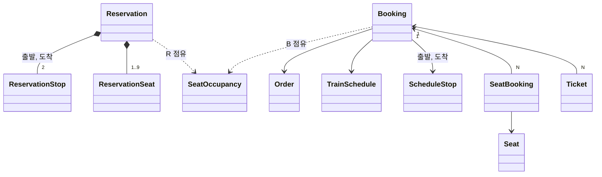

# 예약

## 도메인

- 승객은 좌석을 고르면 먼저 **예약**을 한다. 예약은 결제 전에 좌석을 잠시 잡아 두는 것이다.
  - 예약은 10분 동안 유지된다. 출발 5분 전이 그보다 빠르면 그때까지만 유지된다.
  - 시간 안에 결제하지 않으면 예약은 사라지고 좌석은 다시 팔 수 있게 된다.
  - 출발 5분 전부터는 예약할 수 없다. 취소된 운행도 예약할 수 없다.
- 예약 하나는 한 운행, 한 구간, 한 객차의 좌석들이다.
  - 승객 1~9명이 각자 좌석 하나씩을 가진다. 같은 좌석을 두 번 고를 수 없다.
  - 승객마다 유형(어른, 어린이 등)이 있고 유형별 할인 운임이 붙는다.
- 같은 좌석의 같은 구간은 한 사람만 잡을 수 있다. 동시에 여러 명이 잡으려 하면 한 명만 성공한다.
  - 구간이 겹치지 않으면 같은 좌석을 여러 예약이 나눠 잡을 수 있다.
- 승객은 자기 예약을 조회하고 취소할 수 있다. 다른 회원의 예약은 볼 수도 지울 수도 없다.
- 예약을 주문으로 묶어 결제하면 **예매**가 된다.
  - 예매는 확정된 구매다. 예약과 달리 만료되지 않는다.
  - 예매는 승객마다 **승차권**을 하나씩 발급한다. 승차권은 고유 번호와 운임을 가진다.
  - 승객은 예매를 다가오는 것, 지난 것으로 나눠 조회하고, 승차권의 영수증을 볼 수 있다.

## 용어

| 한국어 | 영어 | 설명 |
|---|---|---|
| 예약 | Reservation | 결제 전의 임시 좌석 확보. Redis에 TTL로 저장된다 |
| 좌석 점유 | SeatOccupancy | 좌석의 구간 한 칸을 누가 잡고 있는지. 예약(`R:`) 또는 예매(`B:`)다 |
| 구간 칸 | section | 정차 순서 i에서 i+1로 가는 한 칸. 출발 stopOrder d, 도착 a인 예약은 d..a-1 칸을 점유한다 |
| 회원 인덱스 | - | 회원이 가진 예약 목록. 예약 ID로 운행을 찾는 데 쓴다 |
| 예매 | Booking | 결제가 끝난 확정 구매. DB에 저장된다 |
| 예매 좌석 | SeatBooking | 예매가 차지한 좌석과 구간 |
| 승차권 | Ticket | 예매의 승객 한 명분. 승차권 번호와 운임을 가진다 |
| 승객 유형 | PassengerType | 어른, 어린이, 유아, 경로, 중증 장애, 경증 장애, 국가유공자 |

## 도메인 모델

### [예약] Redis

#### 예약(Reservation)
Aggregate Root, record. Redis에 JSON으로 저장한다

- 속성: `reservationId`, `memberNo`, `trainScheduleId`, `trainNumber`, `trainName`, `operationDate`, `departure`, `arrival`, `departureAt` 출발 일시, `carType`, `seats`, `totalFare`, `createdAt`, `expiresAt`
- 행위
  - `static create(..., ttl)`: 좌석 운임을 합해 총 운임을, 생성 시각 + TTL로 만료 시각을 정한다
  - `static bookingCloseAt(departureAt)`: 예약 마감 시각(출발 5분 전)
- 규칙
  - 예약 ID는 `RV` + `yyyyMMddHHmmss` + 영대문자, 숫자 6자리다
  - TTL은 `min(10분, 예약 마감까지 남은 시간)`이다. 마감이 지났으면 만들 수 없다
  - 예약은 만들 때의 열차, 정차역, 운임을 복사해 가진다. 이후 열차 캐시가 바뀌어도 예약은 바뀌지 않는다
  - `departureAt`은 자정을 넘긴 운행이면 운행일 다음 날이다

#### 예약 정차역(ReservationStop), 예약 좌석(ReservationSeat)
Value Object, record

- 정차역: `stopId`, `stopOrder`, `stationId`, `stationName`, `time`
- 좌석: `seatId`, `trainCarId`, `carNumber`, `seatLabel`, `passengerType`, `fare`

#### 좌석 점유 값(SeatOccupancyValue)
Value Object, record

- 속성: `type` 예약(`R`) 또는 예매(`B`), `id` 예약 ID 또는 예매 ID
- 행위: `serialize()` → `R:{reservationId}`, `B:{bookingId}`, `static parse(value)`
- 규칙
  - 형식이 다른 값은 데이터 오염이다. 스크립트는 아무것도 쓰지 않고 오염을 알린다

#### Redis 키
원본은 `raillo-domain`의 `ReservationCacheKey`다. 모든 운행 키는 [열차 캐시](../train/README.md)와 같은 `{schedule:id}` hash tag를 쓴다.

| 키 | 타입 | 만료 |
|---|---|---|
| `{schedule:{id}}:car:{trainCarId}:seats` field `{seatId}:{section}` | Hash, 값은 좌석 점유 값 | 키: 운행일 + 2일 00:00. `R:` field: 예약 TTL. `B:` field: 없음 |
| `{schedule:{id}}:reservation:{reservationId}` | String, 예약 JSON | 예약 TTL |
| `{schedule:{id}}:reservation:{reservationId}:order` | String, orderCode | 결제 마감 |
| `member:{memberNo}:reservations` field `{reservationId}` | Hash, 값은 trainScheduleId | field: 예약 TTL |

#### 좌석 점유 스크립트
`raillo-api/src/main/resources/scripts/`에 있다. 모두 검사를 먼저 하고, 충돌하면 아무것도 쓰지 않는다.

| 스크립트 | 하는 일 |
|---|---|
| `reservation_create.lua` | 요청 구간 칸이 모두 비어 있으면 `R:` field와 예약 본문을 같은 TTL로 쓴다 |
| `reservation_delete.lua` | 값이 정확히 자기 `R:{reservationId}`인 field만 지우고 예약 본문을 지운다 |
| `reservation_booking_confirm.lua` | 자기 `R:`, 자기 `B:`, 빈 field를 `B:{bookingId}`로 바꾸고 field 만료를 없앤다. 예약 본문을 지운다 |
| `reservation_payment_hold.lua` | 결제 결과를 모르는 동안 자기 `R:` field의 만료를 없앤다 |
| `reservation_payment_release.lua` | 결제 실패가 확정되면 field 만료를 주문 표시 키나 예약 본문의 남은 TTL로 되돌린다 |

- 규칙
  - **만료가 없다는 것만으로 `B:` field라고 판단하면 안 된다.** 결제 중 보호된 `R:` field도 만료가 없다
  - 결제 중 보호(hold, release)와 주문 표시 키는 아직 결제 흐름에 연결되지 않았다

### [예매] DB

#### 예매(Booking)
Aggregate Root

- 속성: `member`, `order`, `trainSchedule`, `departureStop`, `arrivalStop`, `bookingStatus`, `bookingCode` 고객용 예매 코드, `cancelledAt`
- 행위
  - `static create(member, order, trainSchedule, departureStop, arrivalStop)`: 예매 완료 상태로 만든다
  - `cancel()`: 예매 취소
- 규칙
  - 예매 코드는 `yyyyMMddHHmmss` + 영대문자, 숫자 4자리다
  - 이미 취소된 예매는 다시 취소할 수 없다
  - 예매 취소 API는 아직 없다. 예매 삭제 API는 DB 행을 지우며, Redis의 `B:` field는 키가 만료될 때까지 남는다

#### 예매 좌석(SeatBooking)
Entity, Booking N:1

- 속성: `seat`, `passengerType`, 그리고 조회용으로 복사한 `trainSchedule`, `carType`, `departureStationId`, `arrivalStationId`, `departureStopOrder`, `arrivalStopOrder`
- 규칙
  - 잔여석 계산과 충돌 검사가 조인 없이 구간을 비교하도록 정차 순서를 복사해 둔다

#### 승차권(Ticket)
Entity, Booking N:1

- 속성: `seat`, `passengerType`, `ticketStatus`, `ticketNumber`, `fare`
- 행위: `static create(...)`, `cancel()`, `use()`
- 규칙
  - 승차권 번호는 `MMdd-예약순번 7자리-승객순번 2자리`다(예: `0117-0000001-01`). 예약 순번은 Redis `ticketSeq:{MMdd}` 카운터로 날짜마다 1부터 센다
  - 발급 상태에서만 취소하거나 사용할 수 있다. 취소, 사용 API는 아직 없다

#### 예매 상태(BookingStatus), 승차권 상태(TicketStatus)
Enum

- 예매: `BOOKED` 예매 완료, `CANCELLED` 예매 취소
- 승차권: `ISSUED` 발급, `USED` 사용, `CANCELLED` 취소

### 서비스

`raillo-api`의 `booking/application/`에 있다.

#### 예약 서비스(ReservationService)

- `reserve(reservation, ttl)`: 회원 인덱스를 쓰고 좌석을 점유한다
- `cancel(reservationId, memberNo)`: 좌석 점유를 해제하고 회원 인덱스를 지운다. 없거나 만료된 예약은 성공으로 본다
- `convertToBooking(request)`: 결제가 확정된 예약의 점유를 예매 점유로 바꾼다
- `discardReservation(...)`: 좌석은 두고 예약 본문과 회원 인덱스만 지운다
- 규칙
  - 충돌하면 상대가 예약인지 예매인지 구분해 오류를 낸다

#### 예매 서비스(BookingService)

- `createBookingFromOrder(order)`: 결제가 끝난 주문의 주문 예매마다 예매, 예매 좌석, 승차권을 만든다
- 규칙: 결제가 완료된 주문에서만 만들 수 있다

#### 좌석 충돌 재검증(BookingValidator.validateSeatConflicts)

- 결제 직전에 예약 구간과 겹치는 DB 예매 좌석이 있으면 거절한다. 구간은 예약이 복사해 둔 정차 순서를 쓴다

## 설계 결정

### 좌석 점유는 객차별 Hash의 구간 칸 field로 표현한다
- 맥락: 같은 좌석을 겹치지 않는 구간에 나눠 팔아야 하고, 동시에 같은 좌석을 잡는 요청 중 하나만 성공해야 한다.
- 결정: 객차마다 Hash 하나를 두고 field를 `{seatId}:{구간 칸}`으로 쓴다. 예약은 자기 구간의 칸을 모두 검사하고 비어 있으면 한 Lua 스크립트 안에서 모두 쓴다.
- 결과: 겹침 판단이 field 존재 여부로 끝나고, 검사와 쓰기 사이에 다른 요청이 끼어들 수 없다. 구간이 길수록 field가 늘어난다.

### 예약 field는 field 단위로 만료시키고 예매 field는 만료시키지 않는다
- 맥락: 한 객차 Hash에 예약 점유와 예매 점유가 섞인다. 키 단위 TTL로는 예약만 만료시킬 수 없다.
- 결정: `R:` field에는 예약 TTL로 `HEXPIRE`를 걸고, `B:` field는 만료 없이 둔다. 키 자체는 열차 캐시와 같이 운행일 + 2일에 만료한다.
- 결과: 결제하지 않은 예약은 별도 정리 작업 없이 좌석을 내놓는다. Hash field 만료를 지원하는 Valkey 9가 필요하다.

### 회원 인덱스는 좌석 점유보다 먼저 쓰고, 지울 때는 나중에 지운다
- 맥락: 회원 인덱스 키는 `{schedule:id}` hash tag 밖에 있어 점유 스크립트와 원자적으로 묶을 수 없다. 둘 사이에서 실패하면 한쪽만 남는다.
- 결정: 만들 때는 인덱스를 먼저 쓰고, 점유가 실패하면 인덱스를 되돌린다. 지울 때는 점유를 먼저 해제하고 인덱스를 나중에 지운다.
- 결과: 좌석을 점유한 예약은 항상 회원 인덱스로 찾아 지울 수 있다. 반대로 점유 없는 인덱스가 남을 수 있지만, field 만료로 사라지고 조회는 본문이 없으면 만료로 처리한다.

### 점유 응답이 실패하면 저장 여부를 확인한다
- 맥락: 응답 타임아웃이면 스크립트가 이미 저장을 마쳤을 수 있다. 실패로 보고 인덱스를 지우면 좌석은 잡혔는데 회원은 예약을 찾을 수 없다.
- 결정: 예외가 나면 예약 본문이 있는지 확인하고, 있으면 성공으로 처리한다. 데이터 오염 응답은 아무것도 쓰지 않았다는 확정 신호이므로 확인하지 않고 실패로 처리한다.
- 결과: 타임아웃이 나도 좌석과 인덱스가 어긋나지 않는다.

### 결제 직전에 DB 예매와 한 번 더 비교한다
- 맥락: 좌석 충돌은 Redis 점유로 막지만, Redis 데이터가 유실되면 이미 예매된 좌석을 다시 예약할 수 있다.
- 결정: 결제 단계에서 예약 구간과 겹치는 DB 예매 좌석을 조회해 있으면 거절한다.
- 결과: Redis를 잃어도 이중 판매는 결제 전에 막힌다. 결제마다 DB 조회가 하나 늘어난다.
