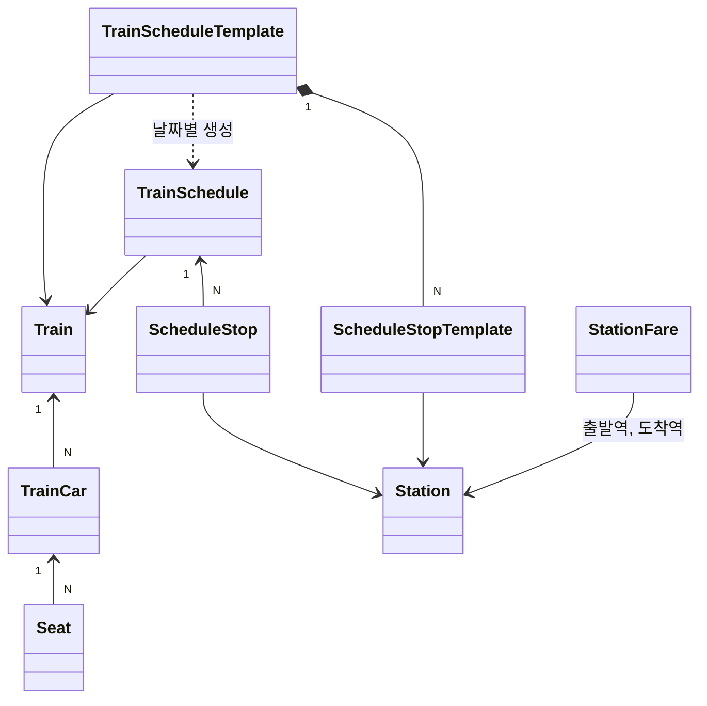

# 열차

## 도메인

- 레일로는 KTX 승차권을 예매하는 서비스다. 열차 도메인은 **무엇을, 언제, 어디서 어디까지, 얼마에** 팔 수 있는지를 정한다.
- 열차는 여러 객차로, 객차는 여러 좌석으로 구성된다.
  - 객차는 일반실과 특실로 나뉜다. 일반실은 2+2, 특실은 2+1 배열이다.
  - 좌석은 열과 행으로 위치를 가진다(예: 3A). 객차 앞쪽 절반은 순방향, 뒤쪽 절반은 역방향이다.
- 열차는 시간표에 따라 운행한다.
  - 시간표(운행 템플릿)는 운행 요일과 정차역 순서를 가진다.
  - 날짜마다 그 요일에 해당하는 시간표로 **운행**을 만든다. 운행은 특정 날짜에 한 열차가 한 번 달리는 것이다.
  - 운행은 여러 **정차역**을 순서대로 지난다. 자정을 넘겨 도착하는 운행도 있다.
- 승객은 운행의 두 정차역 사이 **구간**을 탄다.
  - 같은 좌석이라도 구간이 겹치지 않으면 여러 승객에게 팔 수 있다. 서울 → 대전과 대전 → 부산은 겹치지 않는다.
- 운임은 구간(출발역 → 도착역)과 객차 등급으로 정해지고, 승객 유형(어린이, 경로 등)에 따라 할인된다. 구간은 방향이 있다.
- 승객은 운행 캘린더 → 열차 검색 → 객차 선택 → 좌석 선택 순으로 고른다.
  - 오늘부터 1개월 뒤까지 검색할 수 있다.
  - 출발 5분 전부터는 예약할 수 없으므로 검색에도 나오지 않는다.
  - 잔여석은 이미 팔린 좌석(예매)과 결제를 기다리는 좌석(예약)을 모두 뺀 값이다.
- 운행은 지연되거나 중단, 취소될 수 있다. 지연이 누적 5분 이상이면 지연 운행이다.

## 용어

| 한국어 | 영어 | 설명 |
|---|---|---|
| 역 | Station | 열차가 서는 곳 |
| 열차 | Train | 편성. 열차 번호와 차종(KTX, KTX-산천 등)을 가진다 |
| 객차 | TrainCar | 열차를 이루는 칸. 일반실 또는 특실 |
| 좌석 | Seat | 객차 안의 자리 |
| 운행 템플릿 | TrainScheduleTemplate | 요일별로 반복되는 시간표 |
| 운행 | TrainSchedule | 특정 날짜에 한 열차가 한 번 달리는 것 |
| 정차역 | ScheduleStop | 운행이 서는 역. 정차 순서(stopOrder)와 도착, 출발 시각을 가진다 |
| 구간 | - | 운행의 두 정차역 사이. `[출발 stopOrder, 도착 stopOrder)` |
| 구간 운임 | StationFare | 출발역 → 도착역의 일반실, 특실 기본 운임 |
| 잔여석 | - | 구간에서 아직 팔 수 있는 좌석 수 |
| 열차 캐시 | TrainCache | Batch가 Redis에 적재한 열차, 운행 정보. DB 조회를 대신하는 캐시가 아니라 예약 생성이 읽는 유일한 원본이다 |

## 도메인 모델

### [역]

#### 역(Station)
Aggregate Root

- 속성: `id`, `stationName` 역 이름
- 행위: `static create(stationName)`

#### 구간 운임(StationFare)
Aggregate Root

- 속성: `departureStation` 출발역, `arrivalStation` 도착역, `standardFare` 일반실 운임, `firstClassFare` 특실 운임
- 규칙
  - 구간은 방향이 있다. 서울 → 부산과 부산 → 서울은 다른 운임이다
  - 운임은 `BigDecimal`이다

### [열차]

#### 열차(Train)
Aggregate Root

- 속성: `id`, `trainNumber` 열차 번호, `trainType` 차종, `trainName`, `totalCars` 객차 수
- 행위: `static create(trainNumber, trainType, trainName, totalCars)`

#### 객차(TrainCar)
Entity, Train N:1

- 속성: `carNumber` 호차 번호, `carType` 등급, `seatRowCount` 행 수, `totalSeats` 좌석 수, `seatArrangement` 배열(`2+2`, `2+1`)
- 규칙
  - 차종별 객차 구성과 등급별 좌석 배열은 Batch의 `train-template.yml`이 정한다

#### 좌석(Seat)
Entity, TrainCar N:1

- 속성: `seatRow` 행, `seatColumn` 열(A~D), `seatType` 창가/통로, `isAccessible`, `isAvailable`
- 규칙
  - 행이 객차 가운데 이하면 순방향, 넘으면 역방향이다. 가운데 두 행은 4인 동반석이다
  - `isAccessible`, `isAvailable`은 항상 `Y`이고 조회에 쓰이지 않는다. 좌석 단위 판매 중지는 아직 없다

### [운행 템플릿]

#### 운행 템플릿(TrainScheduleTemplate)
Aggregate Root, ID는 UUID

- 속성: `scheduleName`, `operatingDay` 운행 요일, `departureTime`, `arrivalTime`, `train`, `departureStation` 시발역, `arrivalStation` 종착역, `scheduleStops`
- 행위: `static create(...)`, `addScheduleStop(stop)`
- 규칙
  - 운행 요일은 비트마스크다. 월 = 1, 화 = 2 … 일 = 64, 매일 = 127

#### 정차역 템플릿(ScheduleStopTemplate)
Entity, 운행 템플릿에 포함(cascade)

- 속성: `stopOrder`, `arrivalTime`, `departureTime`, `station`

### [운행]

#### 운행(TrainSchedule)
Aggregate Root

- 속성: `operationDate` 운행일, `departureTime`, `arrivalTime`, `operationStatus`, `delayMinutes`, `train`, `departureStation`, `arrivalStation`
- 행위
  - `static create(operationDate, template)`: 템플릿으로 운행을 만든다
  - `addDelay(minutes)`: 지연을 누적한다
  - `recoverDelay()`: 지연을 0으로 되돌린다
  - `updateOperationStatus(status)`
  - `getDepartureDateTimeAt(stop)`: 정차역의 출발 일시를 계산한다
- 규칙
  - 생성 직후 상태는 정상 운행, 지연 0분이다
  - 누적 지연이 5분 이상이면 지연 운행이 된다. 지연을 회복하면 정상 운행이다
  - 정차역 출발 시각이 운행 출발 시각보다 이르면 자정을 넘긴 것이므로 다음 날이다. **정차역 시각을 직접 비교하지 말고 `getDepartureDateTimeAt`을 쓴다**
  - 상태를 바꾸는 API나 Job은 아직 없다

#### 정차역(ScheduleStop)
Entity, TrainSchedule N:1

- 속성: `stopOrder` 정차 순서, `arrivalTime`(시발역은 null), `departureTime`(종착역은 null), `station`
- 행위: `static create(template, trainSchedule)`
- 규칙
  - 출발역의 `stopOrder`가 도착역보다 작아야 유효한 구간이다
  - 두 구간은 `기존 도착 stopOrder > 새 출발 stopOrder`이고 `기존 출발 stopOrder < 새 도착 stopOrder`일 때 겹친다

#### 운행 상태(OperationStatus)
Enum

- `ACTIVE` 정상 운행, `DELAYED` 지연, `SUSPENDED` 운행 중단, `CANCELLED` 운행 취소
- 캘린더는 `ACTIVE`, `DELAYED`를 운행일로 보고, 검색은 `ACTIVE`만 보여준다

### 도메인 서비스

`raillo-api`의 `train/application/`에 있다.

#### 운임 계산(FareCalculator)

- `calculateFare(...)`: 구간 운임에 승객 유형 할인율을 곱한다
- 규칙
  - 할인율: 어린이 40%, 유아 75%, 경로 30%, 중증 장애 50%, 경증 장애 30%, 국가유공자 50%
  - 결과를 반올림하지 않는다

#### 잔여석 계산(SeatAvailabilityCalculator)

- `calculateSectionSeatStatus(...)`: 등급별 잔여석과 예약 가능 여부를 계산한다
- 규칙
  - 잔여석 = 전체 좌석 − (구간이 겹치는 DB 예매 ∪ 구간이 겹치는 Redis 점유). 같은 좌석은 한 번만 뺀다
  - 잔여석은 음수가 되지 않는다
  - 상태: 0석이면 매진, 승객 수보다 적으면 좌석부족, 25% 미만이면 매진임박, 그 외 여유

#### 객차 추천(CarRecommendationService)

- `selectRecommendedCar(cars, passengerCount)`
- 규칙: 승객 수 이상 남은 객차 중 가운데 객차를 고른다. 없으면 첫 객차다

### 열차 캐시(TrainCache)

예약 생성은 DB를 읽지 않고 이 캐시만 읽는다. 키 계약의 원본은 `raillo-domain`의 `TrainCacheKey`다.

| 키 | 값 | 만료 |
|---|---|---|
| `train:seat:{seatId}` | SeatCacheValue | 없음 |
| `train:traincar:{trainCarId}` | TrainCarCacheValue | 없음 |
| `train:station:{stationId}` | 역 이름 | 없음 |
| `train:fare` Hash, field `{출발역Id}:{도착역Id}` | StationFareCacheValue | 없음 |
| `{schedule:{id}}:info` | ScheduleInfoCacheValue | 운행일 + 2일 00:00 |
| `{schedule:{id}}:stops` Hash, field `st:{역Id}`, `id:{정차역Id}` | ScheduleStopCacheValue | 운행일 + 2일 00:00 |

- 규칙
  - 캐시에 없으면 DB로 돌아가지 않고 예약을 거절한다
  - 정적 키는 만료가 없다. **DB의 열차, 운임을 바꾸면 적재 Job을 다시 돌려야 반영된다**
  - 값은 평문 JSON이고 `@class`를 넣지 않는다

## 설계 결정

### 운행 키는 운행일 기준 절대 시각에 만료한다
- 맥락: 월간 스케줄 Job은 한 달치 운행을 미리 만든다. 적재 시점 기준 상대 TTL이면 운행일 전에 키가 사라진다.
- 결정: `EXPIREAT`으로 운행일 + 2일 00:00(한국 시간)에 만료한다. 2일은 자정을 넘기는 운행과 출발 직전 예약을 고려한 값이다.
- 결과: 언제 적재해도 만료 시각이 같고, 지난 운행 키는 따로 지우지 않아도 사라진다.

### 운행 키는 `{schedule:id}` hash tag로 시작한다
- 맥락: 예약 생성은 한 운행의 열차 캐시와 좌석 점유 키를 함께 다룬다. Redis Cluster에서 slot이 다르면 한 Lua 스크립트로 묶을 수 없다.
- 결정: 운행 단위 키를 좌석 점유 키와 같은 `{schedule:id}` hash tag로 시작한다.
- 결과: 한 운행의 키가 같은 slot에 모인다. 운행에 묶이지 않는 정적 키에는 hash tag가 없다.

### 운행 캘린더는 하루 동안 캐시한다
- 맥락: 캘린더는 모든 사용자에게 같고, 날짜가 바뀌기 전에는 거의 바뀌지 않는데 1개월치 운행일을 매번 집계한다.
- 결정: `/api/v2/trains/calendar`는 `train:calendar`로 캐시하고 매일 00:00에 비운다. `/api/v1`은 캐시 없이 조회한다.
- 결과: 하루 중 운행 상태가 바뀌어도 캘린더에는 다음 날 반영된다.
